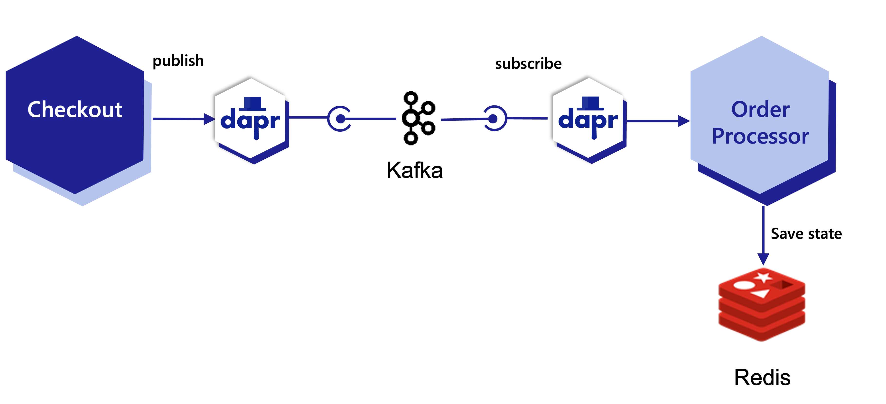

# Dapr 201 Labs

## Pre-requisites

This set of pre-requisites is built with the assumption that participants are using Windows OS.

1. AKS cluster setup (Quickstart: Deploy an AKS cluster by using the Azure portal - Azure Kubernetes Service | Microsoft Learn (https://learn.microsoft.com/en-us/azure/aks/learn/quick-kubernetes-deploy-portal?tabs=azure-cli)): Create New Cluster (You can use either any MS subscription or even Private subscription)
2. WSL2 (Install WSL | Microsoft Learn (https://learn.microsoft.com/en-us/windows/wsl/install)):  Setup following in WSL2:
1. Terminal for WSL2 (Windows Terminal Customization for WSL2 - The Complete Guide (ceos3c.com) (https://www.ceos3c.com/wsl-2/windows-terminal-customization-wsl2/))
2. VS Code: Should be able to open with code . . (Get started using VS Code with WSL | Microsoft Learn (https://learn.microsoft.com/en-us/windows/wsl/tutorials/wsl-vscode))
3. Helm 3 (Helm | Installing Helm (https://helm.sh/docs/intro/install/))
4. Git
5. Connect to AKS on WSL2
6. kubectl is the k8s CLI. It works once you are connected with AKS.
7. Install Dapr (Install the Dapr CLI | Dapr Docs (https://docs.dapr.io/getting-started/install-dapr-cli/)) and run dapr init -k
8. Docker Desktop: Once you setup Docker Desktop on Windows, you should be able to use docker in WSL2 by enabling “Use the WSL 2 based Engine” in Settings → General.
9. Setup a virtual environment for Python (https://docs.python.org/3/tutorial/venv.html) (Atleast version 3.7)


## Welcome to Dapr 201

**Quick Question**: What is the intent of this session?
**Answer***: To get a hang of Daprizing some simple Apps, while using kubernetes. And, try to realize a bit of power that we as service owners may get by using Dapr.

### Deployment architecture

We will create a simple deployment architecture with 2 microservices and a Dapr sidecar. The microservices will be deployed as Kubernetes pods. The Dapr sidecar will be deployed as a Kubernetes sidecar container. The Dapr sidecar will be responsible for service discovery, service invocation, and state management.



We will generate few Order Ids in “Checkout” App itself.
These will be published to Kafka, from where Order Processor will fetch them and save them in Redis state store against “order” key.
In the state store, we should be able to see that order id value for Order is increasing gradually.

We will be using *Python for Checkout* App and *Javascript for Order-Processor* App.

### Container Registry for the Labs

#### Authenticating to GHCR

1. Create a [personal token (classic)](https://docs.github.com/en/authentication/keeping-your-account-and-data-secure/creating-a-personal-access-token) with the following scopes:
    - `read:packages`
    - `write:packages`
    - `delete:packages`
2. Follow the steps in [here](https://docs.github.com/en/packages/working-with-a-github-packages-registry/working-with-the-container-registry#authenticating-to-the-container-registry) to authenticate to GHCR using the token you created in step 1.
3. **Make sure** that any package that is published is marked as public so that it can later be read by the cluster without authentication.

> Note: Make sure to log back into your **work docker logins** after you are done with the labs.

### Dependencies for the Apps

#### State Store

For state store we will be using Redis.

To setup Redis on K8s, we will be using Helm Chart.

Run the following command to install Redis on K8s:

```bash
helm repo add bitnami https://charts.bitnami.com/bitnami
helm repo update

helm install redis bitnami/redis --set auth.enabled=false
```
> Please note that we have disabled auth for now, as want to keep it simple for setup here for lab.

Now when you run `kubectl get pods` you should be able to see the Redis pods running.

```
NAME                   READY   STATUS    RESTARTS        AGE
redis-master-0         1/1     Running   0               2d18h
redis-replicas-0       1/1     Running   0               2d18h
redis-replicas-1       1/1     Running   0               2d18h
redis-replicas-2       1/1     Running   0               2d18h
```

Now, you should be able to connect to your Redis instance with following commands:

Start a redis-client pod:

```bash
kubectl run --namespace default redis-client --restart='Never'  --env REDIS_PASSWORD=  --image docker.io/bitnami/redis:7.0.4-debian-11-r11 --command -- sleep infinity

kubectl exec --tty -i redis-client \
   --namespace default -- bash
```

In the `exec` bash shell of the redis-client container, you should be able to connect to Redis with following command:

```bash
REDISCLI_AUTH="" redis-cli -h redis-master
```

You can check if Redis setup is fine with:

```bash
keys *
```
OR
```bash
ping
```

#### Pub/Sub

For publishing a message from Checkout app and subscribing to it in Order Processor app, we will be using Kafka as Pub/Sub.

To setup Kafka on K8s, we will be using Helm Chart.

Run the following command to install Kafka on K8s:

```bash
helm install my-kafka bitnami/kafka
```

Now when you run `kubectl get pods` you should be able to see the Kafka pods running.

```
NAME                   READY   STATUS    RESTARTS        AGE
my-kafka-0             1/1     Running   0
2d19h
my-kafka-zookeeper-0   1/1     Running   0               2d19h
redis-client           1/1     Running   0               80m
redis-master-0         1/1     Running   0               2d18h
redis-replicas-0       1/1     Running   0               2d18h
redis-replicas-1       1/1     Running   0               2d18h
redis-replicas-2       1/1     Running   0               2d18h
```

Now that both the dependencies are setup, we can move on to the Apps.

### Setup Apps without Dapr

1. Git clone the [labs-201](https://github.com/dapr-learning/labs-201) codebase
1. Once cloned, open it in vs-code using `code .`
1. Observe the app.py once in the `checkout` folder, observe the definitions and usage of KafkaProducer from kafka-python library.
    - It is a very small example and bare minimum to publish orderId to kafka, but very powerful to let us realize that our application is bound with kafka related code.
1. In the `order-processor` folder, observe the definitions and usage of KafkaConsumer from kafka-python library.
    - It is a very small example and bare minimum to consume orderId from kafka, but very powerful to let us realize that our application is bound with kafka related code.
> Note both the above apps do not use Dapr


#### Building and deploying the Apps without Dapr

> Note: Make sure you are logged into to your Container Registry through the docker command

1. To build and push the `checkout` app, from a terminal in WSL2, run:
```bash
# pwd should root folder of labs
cd checkout
docker build -t ghcr.io/<your-username>/checkout:latest .
docker push ghcr.io/<your-username>/checkout:latest
```
2. To build and push the `order-processor` app, from a terminal in WSL2, run:
```bash
# pwd should root folder of labs
cd order-processor
docker build -t ghcr.io/<your-username>/order-processor:latest .
docker push ghcr.io/<your-username>/order-processor:latest
```
3. In the deploy folder, you will find the `checkout-bare.yaml` and `order-processor-bare.yaml` files.
4. Modify the lines in the yaml files to use the image that you just pushed to your container registry.
    1. `image: ghcr.io/<your-username>/checkout:latest`
    2. `image: ghcr.io/<your-username>/order-processor:latest`
5. To deploy the apps, from a terminal in WSL2, run:
```bash
kubectl apply -f order-processor-bare.yaml
kubectl apply -f checkout-bare.yaml
```
6. To check if the apps are running, run:
```bash
kubectl get pods
```
7. To view and follow the logs for the `checkout` app, run:
```bash
kubectl logs -f checkout-<pod-id> python
```
8. To view and follow the logs for the `order-processor` app, run:
```bash
kubectl logs -f order-processor-<pod-id> node
```
9. Right now, we have just deployed apps without dapr. Use https://dapr.quip.com/q6QMADrOPQoM#temp:C:PZce3a8ed0c10724b64b21192967
10. Once you have a terminal connected to Redis, check:
    - Run `hgetall order-processor||orders` to see if the order is added to the state store

### Setup Apps with Dapr

Now let's setup the same apps with Dapr.
Assuming that you have already opened the labs-201 codebase in vs-code, let's move on to the next steps.

First, we will Daprize *order-processor* App. We will do it in 3 parts:
1. Part 1 - Daprize the App (Per app)
2. Part 2- Adding K8s annotations for Dapr to work (Per app)
3. Part 3 - Deploying the Apps and the required components

#### Part 1 - Daprize the App (Order-processor)

- Open `order-processor/package.json`, remove the following dependencies from the `dependencies` section:
    -  "express": "^4.16.4",
    - "ioredis": "^5.2.4",
    - "kafkajs": "^2.2.3"
- Add the following dependency
    - "@dapr/client": "^2.3.0"
- Open the `order-processor/app.js` and replace the **CODEBLOCK 1** with the following code:
```js
import { DaprClient, DaprServer } from '@dapr/dapr';
```
> Now we have just replaced all the dependencies with Dapr client alone
- Replace the **CODEBLOCK 2** with the following code:
```js
const SERVER_HOST = process.env.SERVER_HOST || "127.0.0.1";
const APP_PORT = process.env.APP_PORT ?? '3000';
const DAPR_HOST = process.env.DAPR_HOST || "http://localhost";
const DAPR_PORT = process.env.DAPR_HTTP_PORT ?? "3500";
```
> Now we have defined the Dapr host and port to be used by the Client
- Replace the **CODEBLOCK 3** with the following code:
```js
const server = new DaprServer(SERVER_HOST, APP_PORT, DAPR_HOST, DAPR_PORT);
const client = new DaprClient(DAPR_HOST, DAPR_PORT)
```
> Now we have created a Dapr Server and Client, server for subscribing to the topic and client for saving the state
- Replace the **CODEBLOCK 4** with the following code:
```js
    server.pubsub.subscribe("orderpubsub", "test-topic", async (order) => {
        console.log("Subscriber received: " + JSON.stringify(order))
        const state = [{
            key: "orders",
            value: order        }];
        // Save state into a state store
        await client.state.save(`statestore`, state)
        console.log("Saving Order: ", order)
    });

    await server.start();
```
> Now we have replaced the Kafka Consumer with Dapr PubSub Subscribe method and the Redis save with Dapr State Save method
- That's it, we have Daprized the `order-processor` app. Now let's move on to the next step.

#### Part 2 - Adding K8s annotations for Dapr to work (Order-processor)

- Open the `deploy/order-processor.yaml` file
- Add the following annotations to the `order-processor` deployment:
```yaml
    annotations:
      dapr.io/enabled: "true"
      dapr.io/app-id: "order-processor"
      dapr.io/app-port: "3000"
      dapr.io/enable-api-logging: "true"
```
- Let's build and push the containers:
```bash
# pwd should root folder of labs
cd order-processor
docker build -t ghcr.io/<your-username>/order-processor:latest .
docker push ghcr.io/<your-username>/order-processor:latest
```

#### Part 1 - Daprize the App (Checkout)
- Open the `checkout/requirements.txt` file and remove the following dependencies:
    - requests
    - kafka-python
- Add the following dependency:
    - dapr
- Open the `checkout/app.py` file and replace the **CODEBLOCK 1** with the following code:
```python
import json
import time
from dapr.clients import DaprClient
```
> We have replaced the kafka-python dependency with Dapr client
- In the **CODEBLOCK 2** replace with the following code:
```python
class MessageProducer:

    def __init__(self, pubsub_name, topic):
        self.pubsub_name = pubsub_name
        self.client = DaprClient()
        self.topic = topic

    def __del__(self):
        self.client.close()
```
> We have changed the broker member variable to pubsub_name and removed the producer member variable and replaced it with a Dapr client
- In the **CODEBLOCK 3** replace with the following code:
```python
     def send_msg(self, msg):
        print(f"sending message... {msg}", flush=True)
        try:
            resp = self.client.publish_event(
                pubsub_name=self.pubsub_name,
                topic_name=self.topic,
                data=json.dumps(msg),
                publish_metadata={'rawPayload': 'true'})
            print("message sent successfully...", flush=True)
            return resp
        except Exception as ex:
            return ex
```
> Instead of self.producer.send, we are using the Dapr client to publish the event to the topic.

> Note that we are using the rawPayload metadata to send the message as a string and to let Dapr know to not wrap the message in a CloudEvent envelope.
- In the **CODEBLOCK 4** replace with the following code:
```python
pubsub_name = 'orderpubsub'
topic = 'test-topic'
message_producer = MessageProducer(pubsub_name,topic)
```
> The only variable that has changed is the pubsub_name, we have removed the broker variable and replaced it with pubsub_name. (Name of the Dapr component)
- That's it, we have Daprized the `checkout` app. Now let's move on to the next step.

#### Part 2 - Adding K8s annotations for Dapr to work (Checkout)

- Open the `deploy/checkout.yaml` file
- Add the following annotations to the `checkout` deployment:
```yaml
    annotations:
      dapr.io/enabled: "true"
      dapr.io/app-id: "checkout"
      dapr.io/enable-api-logging: "true"
```
- Let's build and push the containers:
```bash
# pwd should root folder of labs
cd checkout
docker build -t ghcr.io/<your-username>/checkout:latest .
docker push ghcr.io/<your-username>/checkout:latest
```

#### Part 3 - Deploying the Daprized apps

> If not already installed, install Dapr on the cluster, running the following command:
> ```bash
> dapr init -k
> ```
> You should be able to see the status of the Dapr control plane pods using the command:
> ```bash
> dapr status -k
> ```
> Output should be like
> ```
> NAME                   NAMESPACE    HEALTHY  STATUS   REPLICAS  VERSION  AGE  CREATED
> dapr-operator          dapr-system  True     Running  1         1.9.5    2d   2022-12-09 13:35.02
 > dapr-dashboard         dapr-system  True     Running  1         0.11.0   2d   2022-12-09 13:35.02
  >dapr-sidecar-injector  dapr-system  True     Running  1         1.9.5    2d   2022-12-09 13:35.02
  >dapr-sentry            dapr-system  True     Running  1         1.9.5    2d   2022-12-09 13:35.02
  >dapr-placement-server  dapr-system  True     Running  1         1.9.5    2d   2022-12-09 13:35.02
> ```
- Let's create the Dapr components in K8s needed for this lab:
```bash
# pwd should root folder of labs
kubectl apply -f deploy/kafka-pubsub-dapr.yaml
kubectl apply -f deploy/redis-state-dapr.yaml
```
- You can view the applied components using the command
```
dapr components -k
```
> Output should be like
> ```
> NAMESPACE  NAME         TYPE          VERSION  SCOPES  CREATED              AGE
 > default    orderpubsub  pubsub.kafka  v1               2022-12-12 08:15.20  2h
> default    statestore   state.redis   v1               2022-12-12 08:15.30  2h
> ```
- Now let's deploy the apps:
```bash
# These are the modified yaml files order-processor and checkout with the Dapr annotations
kubectl apply -f deploy/order-processor.yaml
kubectl apply -f deploy/checkout.yaml
```
- You can view the deployed pods using the command
```bash
kubectl get pods
```
- To view and follow the logs for the `checkout` app, run:
```bash
kubectl logs -f checkout-<pod-id> python
```
- To view and follow the logs for the `order-processor` app, run:
```bash
kubectl logs -f order-processor-<pod-id> node
```
> Note: You can also view the daprd logs for the apps using the command `kubectl logs -f <pod-name> daprd`
- Right now, we have just deployed apps without dapr. Use https://dapr.quip.com/q6QMADrOPQoM#temp:C:PZce3a8ed0c10724b64b21192967
- Once you have a terminal connected to Redis, check:
    - Run `hgetall order-processor||orders` to see if the order is added to the state store
